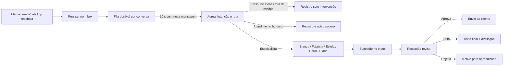

# Estado dos Agentes de Atendimento

**Projeto:** Sistemas Buddha Spa CRM
**Escopo deste documento:** Inbox WhatsApp e orquestração de agentes
**Unidade com configuração ativa auditada:** Ribeirão Shopping (RBS)
**Atualizado em:** 28 de agosto de 2026
**Autor:** Manus AI

---

## 1. Objetivo e estado executivo

Os agentes não substituem a recepção nem executam alterações no Belle. Eles qualificam a conversa, consultam apenas o contexto local permitido e oferecem uma **sugestão revisável** antes de qualquer envio ao cliente. O Belle permanece a fonte de verdade para agenda, dados cadastrais, planos e histórico operacional.

O desenho atual prioriza três resultados: **não atropelar o cliente**, encaminhar cada assunto ao especialista adequado e tornar cada decisão observável. A Áurea identifica intenção e organiza a sequência; os especialistas geram uma etapa de conversa; a recepção revisa, edita, aprova, rejeita ou ignora a sugestão. Nenhuma sugestão de agente deve ser enviada automaticamente ao WhatsApp sem a ação humana prevista no Inbox.

> **Estado atual:** o RBS possui seis agentes ativos, com Áurea em versão 6 e Carol em versão 5. A taxonomia de intenção, a proteção de pesquisa de satisfação Belle e o agrupamento de mensagens já foram versionados no banco compartilhado. As mudanças de código correspondentes devem estar presentes no Railway antes de serem consideradas disponíveis no ambiente operacional.

| Pilar | Situação em 28/08/2026 | Observação |
|---|---|---|
| Roteamento inicial | Ativo | Áurea identifica intenção, confiança e rota. |
| Ordem comercial | Ativa | Explicar → informar preço → conduzir transação. |
| Revisão humana | Ativa | A recepção aprova, edita ou rejeita a sugestão. |
| Agrupamento de mensagens | Implementado | Liberação após 10 segundos de silêncio por conversa. |
| Pesquisa Belle | Implementada | Respostas são registradas e ignoradas pela IA. |
| Taxonomia auditável | Implementada | Intenção, detalhe, origem, confiança e rota ficam no histórico. |
| Painel consolidado de métricas por intenção | Pendente | O log já expõe os campos por execução; falta um painel agregado. |

---

## 2. Arquitetura operacional

O fluxo foi desenhado para separar decisão, geração de texto e ação humana. A mensagem de cliente é persistida no Inbox antes de qualquer processamento. Em vez de chamar a Áurea imediatamente, o sistema abre ou atualiza uma fila durável por conversa. O worker libera o bloco somente quando não houver nova mensagem por dez segundos.

As partes principais estão concentradas em [`server/agentesService.ts`](server/agentesService.ts), [`server/agentesDb.ts`](server/agentesDb.ts), [`server/agentesPolicy.ts`](server/agentesPolicy.ts) e [`server/agentesAgrupamento.ts`](server/agentesAgrupamento.ts). O esquema auditável está em [`drizzle/schema.ts`](drizzle/schema.ts).

### 2.1 Agrupamento antes da Áurea

O agrupamento atende ao comportamento comum do WhatsApp, em que uma pessoa envia a intenção em várias mensagens consecutivas. Cada nova mensagem recebida atualiza o mesmo registro de agrupamento e reinicia o prazo de dez segundos. O resultado de uma versão anterior é descartado caso uma mensagem nova chegue durante o processamento.

Por exemplo, se o cliente enviar `oi`, `bom dia`, `tudo bem?`, `tem horário hoje 16h` e `com Larah?` com intervalos menores que dez segundos, a Áurea recebe o histórico recente como um único contexto, em ordem cronológica. O sistema não precisa concatenar e salvar um texto artificial; ele preserva as mensagens originais e entrega o conjunto ordenado ao orquestrador.

| Proteção | Como funciona |
|---|---|
| Durabilidade | A fila está na tabela `agentes_agrupamentos_mensagens`, não em memória do processo. |
| Reinício de janela | Cada mensagem nova incrementa a versão e atualiza `processarApos`. |
| Sem sobreposição | O worker assume a versão da fila antes de processar. |
| Mensagem durante IA lenta | A versão anterior deixa de ser aproveitada e o bloco atualizado permanece pendente. |
| Recuperação | Processamentos travados podem ser recuperados sem perder a última mensagem da conversa. |

O agendador verifica filas prontas a cada segundo, mas o tempo funcional de espera é definido no banco pelos dez segundos de silêncio. Isto evita `setTimeout` em memória e reduz o risco de perda em reinícios do Railway.

---

## 3. Catálogo de agentes e responsabilidades

| Agente | Papel | O que deve fazer | O que não deve fazer |
|---|---|---|---|
| **Áurea** | Receptora e qualificadora | Ler contexto recente, identificar intenção, calcular confiança e selecionar a próxima rota compatível. | Dar resposta comercial longa, se apresentar ao cliente, inventar informações, escolher um destino inexistente. |
| **Bianca** | Terapias | Explicar terapias com nomenclatura e condições oficiais, usando scripts e tabela comercial. | Usar nomes de campanhas sazonais como se fossem terapias oficiais; antecipar preço ou agendamento quando houver etapa anterior. |
| **Fabrícia** | Day Spa e informações gerais | Explicar experiências Day Spa, estrutura e opções gerais; sugerir o fluxo oficial quando aplicável. | Confirmar disponibilidade de agenda ou preço não solicitado. |
| **Estela** | Preço e condição comercial | Informar valores, promoções e condições a partir da tabela comercial oficial. | Tratar oferta de fornecedor, marketing externo ou contato B2B como pedido de preço de cliente. |
| **Carol** | Preparação de agendamento | Coletar apenas os dados ainda ausentes para a recepção consultar a agenda uma única vez. | Confirmar vaga, prometer disponibilidade, repetir perguntas já respondidas ou reiniciar coleta já encerrada. |
| **Diana** | Voucher | Explicar voucher e conduzir emissão/compra quando for a etapa adequada. | Antecipar emissão quando a pessoa ainda precisa de explicação ou de valor. |

A Diana permanece **unificada** por decisão operacional. A sequência pode colocá-la no início para explicar voucher e, caso a mesma mensagem também trate de preço e emissão, colocá-la novamente após Estela para a transação. A necessidade de separar a Diana em dois agentes só deve ser decidida após observação de casos reais.

---

## 4. Ordem comercial de roteamento

Quando uma mensagem contém mais de uma necessidade, a fila não deve pular para a transação. A regra de prioridade atual é a seguinte:

| Ordem | Natureza do pedido | Agentes possíveis | Exemplo |
|---:|---|---|---|
| 1 | Explicação e valor percebido | Bianca, Diana, Fabrícia | “Como funciona o Day Spa e qual o valor?” |
| 2 | Preço e condição comercial | Estela | “Qual o valor da Relaxante 60?” |
| 3 | Transação | Carol e Diana | “Quero agendar” ou “Quero emitir um voucher.” |

O exemplo “Como funciona o Day Spa e qual o valor?” deve gerar a fila **Fabrícia → Estela**. Já “Como funciona o voucher, qual o valor e depois quero comprar?” deve gerar **Diana → Estela → Diana**. Um pedido de preço isolado começa pela Estela; terapia ou voucher apenas mencionados não devem criar uma explicação não solicitada antes do preço.

As rotas determinísticas estão em [`rotasDeterministicas`](server/agentesPolicy.ts). A Áurea mantém a classificação em JSON estruturado e registra a intenção antes de encaminhar ao especialista.

---

## 5. Intenções registradas e regras de não intervenção

A intenção é diferente do agente de destino. A mesma intenção pode ser encaminhada de forma distinta conforme o contexto, e uma conversa pode demandar mais de uma etapa. A taxonomia atual evita que o sistema fique limitado a “Áurea → Estela” sem explicar por que a decisão ocorreu.

| Intenção técnica | Rótulo no painel | Tratamento esperado |
|---|---|---|
| `informacao_terapia` | Informação sobre terapia | Bianca. |
| `day_spa_e_estrutura` | Day Spa e informações gerais | Fabrícia. |
| `voucher` | Voucher | Diana, conforme a etapa. |
| `preco_e_condicoes` | Valor e condição comercial | Estela. |
| `agendamento` | Agendamento | Carol. |
| `pagamento_e_comprovante` | Pagamento ou comprovante | Registro e rota apenas se houver ação configurada. |
| `cadastro_documentos` | Cadastro e documentos | Registro e preparação compatível com o fluxo. |
| `saudacao` | Saudação inicial | Acolhimento aberto sem apresentação de agente. |
| `pos_atendimento` | Pós-atendimento | Registro e atuação apenas quando definida. |
| `pesquisa_satisfacao_belle` | Pesquisa de satisfação Belle | Não intervenção da IA. |
| `atendimento_humano` | Atendimento humano | Escalonamento auditável e resposta segura. |
| `fora_do_escopo` | Fora do escopo | Não intervenção; detalhe curto e neutro. |
| `sem_intencao_clara` | Sem intenção clara | Não intervenção ou acolhimento inicial, conforme contexto. |

### 5.1 Pesquisa de satisfação Belle

As respostas de satisfação não devem receber texto da IA porque o Belle já faz o retorno automático em duas etapas. A detecção usa a mensagem anterior enviada pela equipe/Belle, e não a nota curta do cliente. Atualmente são reconhecidos os convites:

> “Como foi sua Experiência Buddha Spa?”

> “Como foi o atendimento do nosso profissional?”

Assim, uma resposta como `10 - Excelente` é classificada como **Pesquisa de satisfação Belle**, fica registrada no log e não gera sugestão nem encaminhamento. Se o Belle alterar a redação desses convites, os novos textos precisam ser adicionados à regra determinística em [`server/agentesIntencoes.ts`](server/agentesIntencoes.ts).

### 5.2 Fora do escopo

Mensagens de fornecedor, marketing B2B, agência, recrutamento, currículo, parceria comercial externa, spam ou oferta financeira externa não pertencem ao atendimento de cliente. A Áurea deve registrar `fora_do_escopo` com detalhe curto, por exemplo “oferta de serviço B2B ou marketing”, e não criar sugestão nem encaminhar para Estela.

Esta proteção resolve o padrão observado no contato da Copola Comunicação: palavras comerciais na abordagem de uma empresa externa não podem ser confundidas com pedido de preço de uma cliente.

### 5.3 Atendimento humano

Pedido explícito de pessoa, reclamação, Procon, advogado, processo, ameaça, assédio, constrangimento, violência, nota fiscal ou recibo fiscal devem interromper o fluxo normal. O sistema registra o motivo e apresenta somente a mensagem segura “Por favor, aguarde um momento.” Não tenta escolher um destino chamado `humano`, pois esse destino não é um especialista válido no contrato.

---

## 6. Carol: fluxo de preparação de agendamento

A Carol prepara a informação para que a recepção consulte a agenda uma única vez. Ela não acessa, reserva, confirma nem promete horário. A regra operacional atual é coletar somente o próximo dado faltante, em ordem natural, e encerrar silenciosamente quando só restar ação da recepção.

| Ponto do fluxo | Regra atual |
|---|---|
| Cliente apenas pede agendamento | Perguntar por dia ou horário de preferência. |
| Cliente pede disponibilidade sem período | Perguntar o período preferido. |
| Cliente informa período | Oferecer os slots padrão definidos para dia/período, sempre como sugestão revisável. |
| Cliente informa horário específico | Não substituir por slots; continuar a coleta, em especial da terapia. |
| Terapia não informada e há último atendimento | Perguntar se será a mesma terapia registrada. |
| Terapia não informada e não há histórico | Perguntar abertamente qual será a terapia. |
| Plano ativo | Presumir uso do plano; não perguntar se a pessoa quer utilizá-lo. |
| Preferência profissional | Perguntar apenas se ainda faltar e se for relevante. Profissional, gênero ou indiferença já informados devem ser registrados sem repetição. |
| Novo cadastro | Solicitar dados somente depois da coleta de agendamento e apenas quando o histórico na unidade for zero. |
| Coleta completa | Registrar resumo estruturado e sugerir apenas “Por favor, aguarde um momento ✨”. |

O **bloqueio de etapa** da Carol impede reabrir perguntas respondidas, reiniciar coleta diante de agradecimento ou criar uma pergunta nova quando a recepção só precisa consultar/confirmar a agenda. Nesses casos, a saída silenciosa é deliberada: não há texto no Inbox, mas o resumo da próxima ação fica disponível internamente.

---

## 7. Prompt e versão ativa no RBS

O banco é a fonte operacional dos prompts ativos. Mudanças no repositório não substituem uma versão editada manualmente já ativada no banco. Cada alteração relevante deve criar uma nova versão, arquivar a anterior e registrar autor, data e motivo.

| Agente | Versão ativa RBS | Ativada em | Origem registrada | Estado resumido |
|---|---:|---|---|---|
| Áurea | 6 | 28/08/2026 13:29 | Manus — taxonomia de intenção e pesquisa Belle | Taxonomia, pesquisa Belle, não intervenção e confiança calculada. |
| Bianca | 2 | 19/08/2026 16:39 | Lote 1 — Qualidade assistida | Nomenclatura comercial e sequência de explicação. |
| Carol | 5 | 28/08/2026 11:24 | Manus — disciplina de etapa e preferência de terapeuta | Coleta progressiva e bloqueio de etapa. |
| Diana | 3 | 19/08/2026 17:06 | Regra focalizada — não intervenção | Voucher, com acompanhamento para eventual separação de papel. |
| Estela | 3 | 26/08/2026 00:58 | Regra de domingo | Valores e regra de domingo preservando Lote 1. |
| Fabrícia | 2 | 19/08/2026 16:39 | Lote 1 — Qualidade assistida | Day Spa e informações gerais. |

> A auditoria de 28/08 retornou versões ativas somente para o **Ribeirão Shopping**. Antes de ativar agentes no Shopping Santa Úrsula, deve-se confirmar a criação de agentes, prompts e recursos oficiais para aquela unidade; não assumir herança automática do RBS.

### 7.1 Proteções da Áurea

A versão 6 corrige dois defeitos históricos. O primeiro era o exemplo literal `"confianca":0`, que induzia o modelo a repetir confiança nula em vez de calcular a certeza da intenção. A instrução agora exige inteiro de 0 a 100 calculado por mensagem. O segundo era a tentativa de encaminhar situações humanas para um destino inexistente. Esses casos agora são interceptados antes da IA de roteamento.

A Áurea opera com `reasoningEffort: "minimal"`, sem ferramentas e com `maxTokens: 1200`. A escolha visa impedir que uma classificação curta consuma todo o limite apenas em raciocínio interno, falha observada anteriormente como resposta sem conteúdo textual.

---

## 8. Memória, dados disponíveis e persistência

O sistema usa memória limitada e auditável. Para cada execução, o contexto inclui até doze mensagens recentes da conversa, em ordem cronológica, identificação de unidade/canal e referências locais permitidas do Belle: planos, saldo, quantidade de atendimentos concluídos e último atendimento quando disponível.

| Estrutura | Finalidade |
|---|---|
| `agentes_atendimento` | Catálogo dos agentes e seus papéis. |
| `agentes_prompt_versoes` | Histórico, autoria, versão e status dos prompts por unidade. |
| `agentes_estado_conversa` | Resumo, variáveis, próxima rota e tentativas de qualificação por conversa. |
| `agentes_execucoes` | Log de cada decisão: status, classificação, intenção, detalhe, origem, confiança, rota e rastro técnico. |
| `agentes_agrupamentos_mensagens` | Janela durável de dez segundos e trava de processamento por versão. |
| `agentes_sugestoes` | Sugestão, aprovação/rejeição, edição, texto final, motivo e comentário de avaliação. |
| `agentes_acoes` | Idempotência de fluxo/script por conversa, evitando reenvio não intencional. |
| `agentes_recursos` e tabela comercial | Fontes oficiais que especialistas podem usar conforme papel. |

O sistema não deve armazenar ou exibir respostas internas de raciocínio do modelo. O log preserva somente a decisão necessária para operação e auditoria.

---

## 9. Revisão humana e aprendizado

A sugestão é vinculada à conversa. A equipe pode aceitar e enviar, editar ou rejeitar; após decisão, os botões de avaliação não devem permanecer na tela. O texto que a recepção realmente envia é guardado em `textoFinal`, e o tipo de revisão distingue os principais resultados.

| Decisão humana | Uso na análise posterior |
|---|---|
| Aceita como está | Indício de que conteúdo, etapa e tom estavam adequados. |
| Editada | Deve ser classificada entre ajuste de redação, informação de agenda, resposta manual ou mudança de etapa. |
| Rejeitada | Motivo e comentário ajudam a corrigir regra, fonte factual, contexto ou roteamento. |
| Ignorada/substituída | Indica que contexto passou ou que não havia intervenção útil. |

Uma análise de 60 sugestões da Carol aprovadas com edição mostrou que a edição é heterogênea: **24 perguntas foram removidas**, 29 textos finais ficaram mais longos e 17 ficaram bem mais curtos. A leitura correta não é “copiar o texto final para o prompt”, pois parte relevante dessas alterações depende de disponibilidade real, assinatura da recepção ou decisão operacional fora do alcance da Carol. O bloqueio de etapa foi a intervenção incremental definida para reduzir esse padrão sem reescrever o prompt inteiro.

---

## 10. Métricas e observabilidade

O painel administrativo de agentes exibe sugestões pendentes e indicadores de qualidade por agente. O log da conversa, visível a administradores, exibe agora intenção, confiança, rota e detalhe de não intervenção quando existir.

Uma consulta de leitura em 28/08, com janela de 14 dias, registrou 1.178 execuções concluídas, 224 com erro e 89 ignoradas ainda sem taxonomia preenchida — registros anteriores à migração de intenção. Após a taxonomia entrar em vigor, já havia execuções classificadas deterministicamente como agendamento, terapia, Day Spa, voucher, preço, saudação e pesquisa Belle. Esses primeiros registros devem ser tratados como validação de instrumentação, não como volume suficiente para julgamento de performance.

| Métrica recomendada | Pergunta que responde | Fonte |
|---|---|---|
| Volume por intenção | O que os clientes mais pedem? | `agentes_execucoes.intencao` |
| Confiança por intenção | Em quais temas a Áurea demonstra maior incerteza? | `confianca` e `origemIntencao` |
| Rota efetiva | Para qual especialista a intenção foi encaminhada? | `classificacao` e estado da conversa |
| Taxa de aprovação | A sugestão foi aceita sem correção? | `agentes_sugestoes.avaliacao` |
| Taxa de edição | Onde a recepção ainda complementa conteúdo ou muda a etapa? | `tipoRevisao` e `textoFinal` |
| Rejeição por motivo | A falha é de informação, tom, roteamento, contexto, comercial ou operação? | `motivoAvaliacao` |
| Não intervenção | Quantos casos são pesquisa Belle, fora do escopo, humano ou sem intenção clara? | `intencao` e `status` |
| Erro técnico | Qual falha interrompeu o processamento? | `status = erro` e `rastro` |

O próximo painel analítico pode usar essas métricas sem reler mensagens inteiras. Deve apresentar dados agregados por período, unidade, intenção, destino e resultado de revisão, com possibilidade de abrir somente o registro operacional autorizado quando for necessária investigação.

---

## 11. Regras que não devem ser quebradas

1. **Belle é fonte de verdade.** Agentes não confirmam agenda, saldo ou dados que não estejam em fonte oficial/local autorizada.
2. **Não há envio automático de sugestão.** Fluxos e mensagens exigem a confirmação definida na interface.
3. **A recepção é dona da decisão.** Informação de agenda, negociação excepcional ou encerramento humano não deve ser artificialmente aprendida como texto universal da IA.
4. **Uma etapa por vez.** Explicação vem antes de preço; preço vem antes da transação; Carol coleta apenas o dado seguinte que falta.
5. **Sem apresentação de agentes.** A comunicação é em nome do Buddha Spa; agentes são mecanismos internos.
6. **Limite de concisão.** Respostas comuns têm até 350 caracteres; exceções operacionais aprovadas têm até 650 caracteres.
7. **Sem invenção.** Não criar preço, disponibilidade, terapia, condição, prazo, link ou regra não disponível em fonte oficial.
8. **Pesquisa Belle é intocável.** O Belle conduz as duas etapas e a IA não responde às notas.
9. **Casos humanos são prioritários.** Reclamação, insegurança, jurídico/fiscal ou pedido de pessoa não passam por agente comercial.
10. **Mudanças de prompt são dados de produção.** Sempre criar versão nova, auditar e confirmar unidade correta antes de ativar.

---

## 12. Riscos atuais e pendências recomendadas

| Prioridade | Pendência ou risco | Recomendação |
|---:|---|---|
| P0 | Confirmação de deploy Railway | Confirmar que os commits de agrupamento e taxonomia estão no ambiente em produção antes de atribuir comportamento observado ao novo código. |
| P1 | Taxonomia somente com volume inicial | Acompanhar por 7 a 14 dias antes de adicionar dezenas de novas intenções ou treinar regras com poucos casos. |
| P1 | RBS é a única unidade auditada com prompts ativos | Não habilitar ou copiar o comportamento para SSU sem auditar agentes, recursos, scripts e dados da unidade. |
| P1 | Diana unificada | Medir separadamente as edições/rejeições de explicação e emissão; separar o papel somente se houver mistura recorrente comprovada. |
| P2 | Painel agregado por intenção | Criar visão administrativa semanal com volume, rota, confiança, aprovação, edição e rejeição por intenção. |
| P2 | Pesquisa Belle | Atualizar os detectores se o Belle mudar os textos automáticos da pesquisa. |
| P2 | Fora do escopo | Revisar amostras classificadas assim para ampliar palavras-chave somente quando houver padrão real; evitar regra genérica que bloqueie cliente legítimo. |

---

## 13. Roteiro de teste operacional

Após a confirmação do Railway, a validação manual deve seguir casos pequenos e observáveis. A recepção não deve enviar mensagens de teste repetidas sem marcar que são testes, pois o histórico real influencia o contexto.

| Cenário | Resultado esperado |
|---|---|
| `Oi, bom dia` | Saudação acolhedora, sem apresentação de pessoa/agente. |
| Cinco mensagens curtas enviadas em sequência | Áurea processa somente após dez segundos de silêncio e usa o contexto completo. |
| `Como funciona o Day Spa e qual o valor?` | Fabrícia → Estela. |
| `Quanto custa a Relaxante 60?` | Estela diretamente. |
| `Quero agendar hoje às 16h com Larah` | Carol prepara somente os dados faltantes, sem confirmar vaga. |
| `Como funciona o voucher, quanto custa e quero comprar?` | Diana → Estela → Diana. |
| Resposta `10 - Excelente` após convite Belle | Registro de Pesquisa Belle; sem sugestão de IA. |
| Oferta de agência/fornecedor | Registro Fora do escopo com detalhe; sem Estela e sem sugestão. |
| `Quero falar com uma pessoa` | Atendimento humano com registro de motivo e mensagem segura. |
| Cliente agradece após dados completos | Carol não reabre a coleta nem apresenta despedida automática. |

---

## 14. Histórico recente de mudanças relevantes

| Commit ou versão | Tema | Resultado |
|---|---|---|
| `90fbd57` | Estabilidade da Áurea | Ajuste de esforço/range de tokens para reduzir retorno vazio. |
| Áurea v4 | Confiança e escalonamento | Removeu confiança fixa e tratou escalonamento humano sem destino inválido. |
| Áurea v5 / `ef42c11` | Ordem comercial | Formalizou explicação → preço → transação. |
| Carol v5 | Disciplina de etapa | Impediu perguntas repetidas e coleta reaberta indevidamente. |
| `293bb47` | Agrupamento | Criou janela durável de dez segundos antes da Áurea. |
| Áurea v6 / `46eca3c` | Taxonomia e pesquisa Belle | Intenção auditável, bloqueio de pesquisa e não intervenção fora do escopo. |

---

## 15. Referências internas

[1]: [Orquestrador de agentes](server/agentesService.ts)
[2]: [Políticas determinísticas e ordem comercial](server/agentesPolicy.ts)
[3]: [Taxonomia, pesquisa Belle e fora do escopo](server/agentesIntencoes.ts)
[4]: [Persistência, versões de prompt e memória de conversa](server/agentesDb.ts)
[5]: [Worker de agrupamento por janela de silêncio](server/agentesAgrupamento.ts)
[6]: [Schema das estruturas auditáveis](drizzle/schema.ts)
[7]: [Painel administrativo de agentes](client/src/pages/Agentes.tsx)
[8]: [Análise anterior de evolução dos agentes](analise_evolucao_agentes_2026-08-28.md)
